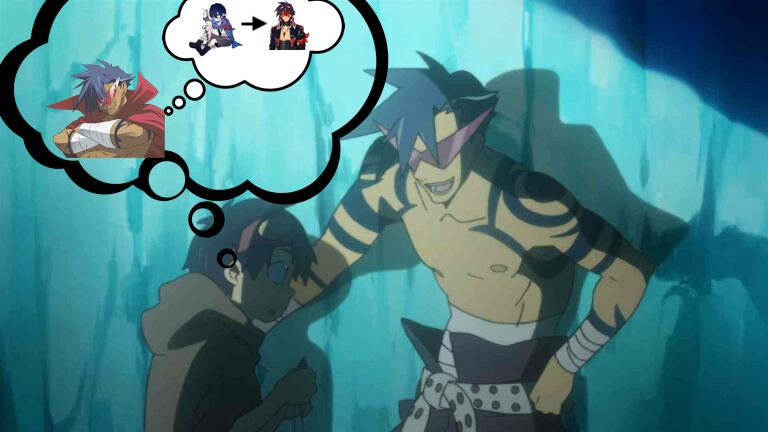

- "Listen Simon, don't believe in yourself, believe in me who believes in you!" - Kamina to Simon, Gurren Lagan
- {:height 440, :width 768}
- [TTGL - Believe in the Me Who Believes in You - YouTube](https://www.youtube.com/watch?v=kC6wdfk2M98)
- This inspiring sentence is also how some religions operate. Believe in an omnipotent all powerful god that believes in you.