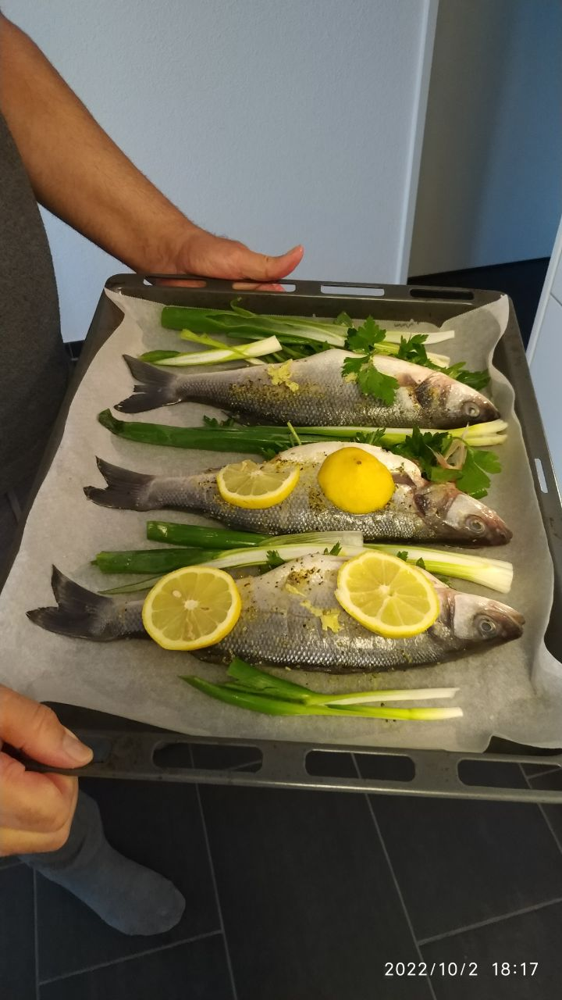

- Dorade for example.
- Put in oven 220C, 20 minutes
- Olive oil on and inside fish (add cuts), add salt and provencial herbs on the fish and fill stomach with parsley.
	- At the end add lemon slices on the fish.
- Spring onions, potatoes and tomatoes can also be oiled up, salted and provincially herbed.
- 