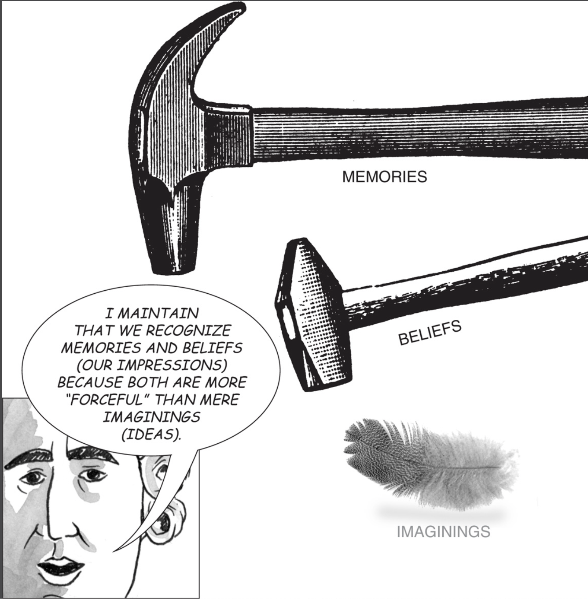
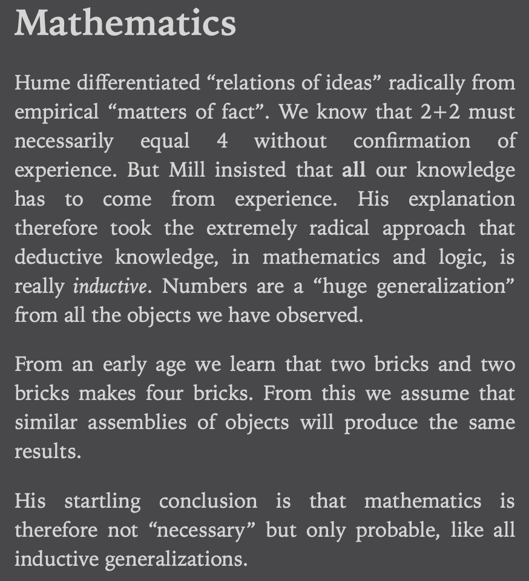
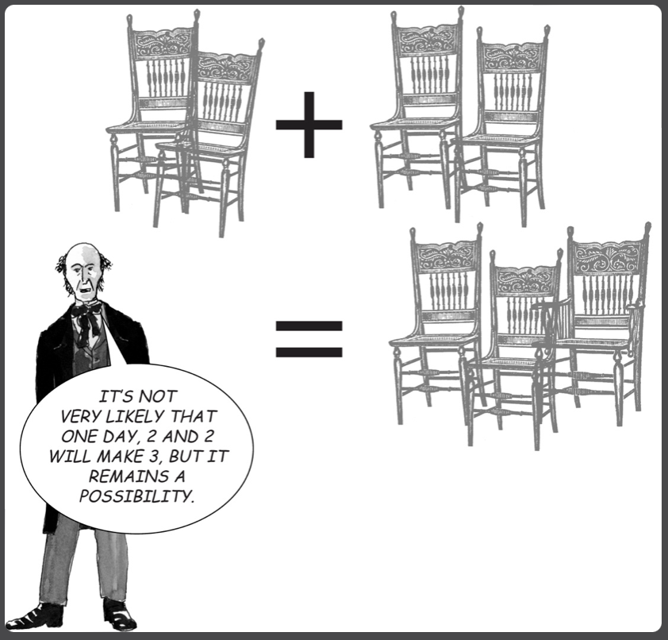

- First, we must accept or at least believe it is probable that there is a **shared reality**, also known as the [[territoryold]].
- Second, we must accept that we are a **sequence of [[experiences]]** (over [time]([[space-time]])) in that **territory**.
	- Note that experiences are derived from the shared reality. The experiences are not the territory but are merely created from it. Just like a traffic light turns red as a consequence of the microcontroller of the traffic light system. Just like trace properties are derivatives of a running computer program.
	- The will is a particular experience and is therefor an illusion as well. However, it is not useful to believe that there is no free will. What makes you answer uniquely compared to others is your genetic footprint and people around you.
- Third, at a given moment in time of the sequence, the territory **imprints** [experience]([[experiences]]) on us. Experience includes our five senses, object recognition, face recognition, language recognition, and cravings, emotions, thoughts and memories.
	- memories, ideas and beliefs. We can pay more attention to one of the experiences but we cannot choose to not experience them. Attention mechanism and the five senses, memories, beliefs, ideas have different weight.
	- Hume creates a useful distinction of  **sense experiences** and other experiences such as memories, ideas and beliefs. These are still imprinted by the territory on us, such as automatic negative beliefs.
	- Endel Tulving further creates a useful distinction of sensory experiences, which if paid attention to become part of the short-term memory, which then become episodic memory if the right motivation and encoding is present. Lastly .
	- Brouwer calls the **temporal attitude** our ability to let imprinted experience become part of a sequence of memories. I believe
	- Further, the **causal attitude** is our ability to let imprinted
- Fourth, we have **experiences that we [instinctively desire]([[instinctive desires]])** at a future time but cannot bring about by a direct impulse of the will at the current time. When these are met the causal attitude | (exploration as opposed to exploitation) is the main part of human experience.
- For this purpose, each of us has a system to reach these desired states.
	- Arguably one of the easiest to relate to system for this is taken from Brouwer's sequences.
		- 1. We have a collection of remembered sequences of experiences due to the **temporal attitude**.
		- 2. We then take these remembered sequences and cut-and-paste remembered sequences in the past to create a plan-to-action sequence to reach an **instinctively desired** experience.
		- Examples:
			- You instinctively desire the experience of eating a cheeseburger.
				- 1. You did this in the past, so you remember the sequence of experiences where you got car keys and drove to McDonalds to get one.
				- 2. You also remember the sequence where you last put the car keys.
				- From these two sequences you can create a new sequence that will result in the desired sequence through a sort of cut-and-paste reasoning, where you paste the sequence of getting the car key into the sequence of getting the car key and then driving to McDonalds.
			- You desire to know the length of the diagonal of a rectangle as a means to a further goal.
				- 1. You calculated the length of the diagonal of a rectangle in a past sequence where you used length and width to achieve this by calculating $sqrt(w^2+h^2)$.
				  2. In another sequence your friend told you the width and height of the diagonal.
				  3. And in yet other sequences you computed square roots and squares using a calculator.
				  From these you can paste together a new sequence, a plan-to-action, with which the diagonal of a rectangle is computed.
	- [Maps]([[Map vs. Territory]]) are created from common experiences using what Brouwer calls the **causal attitude**.
	- [[Language]] is a useful tool for finding such instinctively desired sequences of experience.
		- It names sequences of experiences that appear over and over. A special case of the [[causal attitude]]  are found using the causal attitude and abstracted into causal sequences.
		- The use of language is the clearest evidence for intersubjective experiences.
		- It can help you organise your experiences.
			- Language forces a structure on you that ... Sapir-whorf.
			- Examples in math: **madlibs** for rapping.
			- 2a. Specifically, this is done by finding a sequence with typed holes that can be filled through valid sequences of that type. This is similar to term rewriting where the target term is the goal and the sequences are term rewriting rules, which is similar to natural deduction proving where a lemma (goal) needs to be proven through inference rules.
		- It can help communicate experiences.
			- Formal programming languages are used to communicate experiences about strings and numbers.
		- Sharing aspect
			- Vernunfsdressur.
		- that can be used to describe some sequences of experience.
		- It can also be useful for expressing **madlibs** of mathematics or template.
		- Language cannot share the experience of cycling on a bike for example or the experience of  the shimmer of an iridescent butterfly. It can merely describe it.
		- Constructive language
		- 2a. Specifically, this is done by finding a sequence with typed holes that can be filled through valid sequences of that type. This is similar to term rewriting where the target term is the goal and the sequences are term rewriting rules, which is similar to natural deduction proving where a lemma (goal) needs to be proven through inference rules.
		- is similar to this and so is Haskell. [[pattern matching]] and   from a goal sequence and finding, through [[pattern matching]], sequences that can be inserted to validate the experience.
	- Sequences of experiences that appear over and over in experiences are found using the causal attitude and abstracted into causal sequences.
		- [[Objects]] are a special case of causal sequences.
			- The sequence of seeing green hairy stuff on the floor, smelling it after mowing it, touching it with the hands and tasting it will all be united as a causal sequence **grass**. We **construct** the concept grass from these experiences. Berkeley calls these experiences images of particulars from which we learn the abstract concepts.
			- Hume's fork to distinguish between A and B.
		- Beliefs
		- Memories
		- Imaginings
	- Other introspective models are discussed in [[phenomenology]].
	-
	- “Causal “necessity” is psychological, not logical. All we ever observe are constant conjunctions in the world, not causes, and we acquire a “disposition” to expect Bs when we see As, or vice versa.”
	- We expect there to be smoke when there is fire and vice versa.
	-
	- We have a current experience, called the **impression** because it is impressed on us and ideas are fainter copies of the original (Hume).
	- “Original impressions inevitably place restrictions on those ideas we can subsequently imagine.” - Hume
	- There can be no idea without a corresponding impression.
	- Can we distinguish between impressions and ideas?
		- Memories are more forceful (vivid) than ideas.
		- {width 400}
	-
	- Hume's fork: Matters of fact and relations of ideas. A triangle is a three-sided figure is relation of ideas, whereas sam is male is a matter of fact.
	-
	- Physical objects are a constraint on possible sensations:
	- “If someone were in that room, then they would have bed-like experiences” - Mill
	-
	- “Mill thinks 'possible experiences' are somehow objective, independent of us, and that we receive them involuntarily. But how can sensations “exist” independently of minds?”
		- 
		- 
	-
	- Another useful tool is to introduce the tool of a [map]([[Map vs. Territory]]). For each sequence of experience it  judges whether that sequence is possible or impossible (or unknown to be possible).
	- Other judgements of sequences are: Have they happened? Did I copy this sequence from someone? etc.
	- Another useful tool is to judge whether a sequence has been directly experienced or copied.
		- Both sequences should always be scrutinised by the tool to see if they are true or not.grass
		- Learnt helplessness -> can be experienced or copied. not the same!
	- Reinforcement learning gives a more concrete definition on wanting and reaching.
	- Another useful model is to study the biological brain and figure out how precisely it works.
- https://plato.stanford.edu/entries/brouwer/weakcounterex.html
- For this purpose, each of us has a mental [map]([[Types of maps]]) with which we navigate this shared reality to reach these instinctively desired experiences.