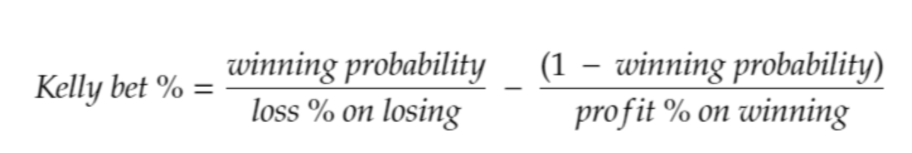

tags:: mani

- k = fraction of bet income, B = profit% on win, A=loss% on losing, p = probability of success
- $B_1 = (1+kB)^p + (1-kA)^{1-p}  =$ returns of $i$-th try
- $B_2 =  ((1+kB)^p + (1-kA)^{1-p})(1+kB))^p + (1-kA)^{1-p}$
- $E[S_n] = (1+kB)^{p\cdot n} + (1-kA)^{(1-p)\cdot n}$
- $\underset{k}{\text{argmax}} \: E[S_n] = \underset{k}{\text{argmax}} \: log(E[S_n]) = \underset{k}{\text{argmax}} \: log(1+kB) \cdot (p\cdot n) + log(1-kA) \cdot ((1-p)\cdot n) = \underset{k}{\text{argmax}} \: log(1+kB) \cdot p + log(1-kA) \cdot (1-p)$
- $\frac{\delta}{\delta k} log(E[S_n]) = p \cdot \frac{B}{1+kB} - (1-p) \cdot \frac{A}{1-kA} \overset{!}{=} 0$
- $p \cdot B \cdot (1-kA) = (1-p) \cdot A \cdot (1+kB)$
- $p B - p B kA = (1-p) A + (1-p)  k B A$
- $p B - (1-p) A =  (1-p)  k B A + p B k A = k B A$
- $k = \frac{p B - (1-p) A}{B A} = \frac{p}{A} - \frac{1-p}{B}$
	- 
- $\frac{p B}{B A - 2p B A} =\frac{1}{\frac{A}{p} - 2BA}$
- https://n2d4.github.io/kelly/