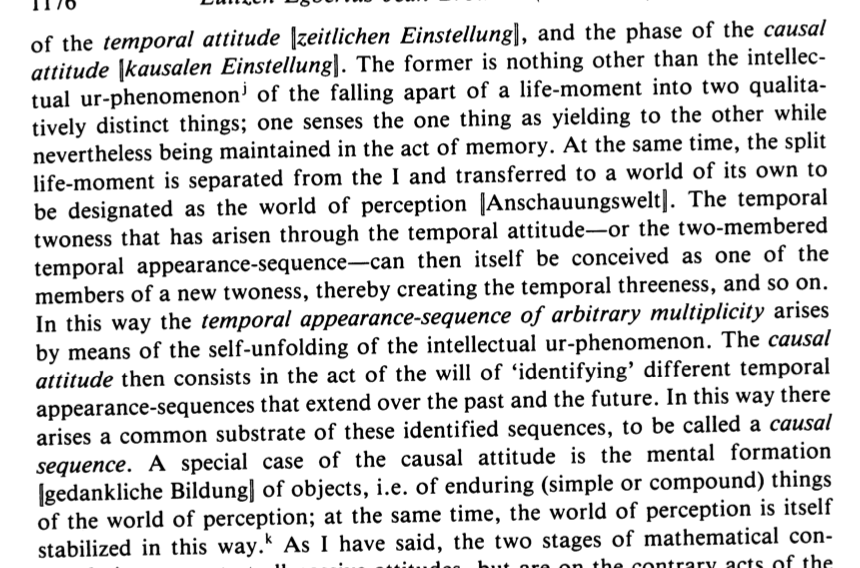

title:: Map vs. Territory
tags:: sona, lon

- The map vs. territory distinction is a useful [[Foundation]]  for 'what' there is, for the study of knowledge, epistemology.
- First, we must accept or at least believe it is probable that there is a **shared reality**, also known as the **territory**.
- First, we must accept that we are a **sequence of experiences** over **time** in a **shared reality**.
- Further, we have experiences that we **instinctively desire** at a future time but cannot bring about by a direct impulse of the will at the current time.
- For this purpose, each of us has a mental [map]([[Types of maps]]) with which we navigate this shared reality.
- A useful model for us.
	- We experience the territory at a **shared time**. We are a **sequence of experiences** over time. We observationally experience something at time t and in the next step remember this sequence of experiences. Further, we **instinctively** desire past experiences and try to get more of them by copying and modifying remembered sequences from the past to get there.
	- Example:
	  collapsed:: true
		- You instinctively desire the experience of eating a cheeseburger.
		- 1. You did this in the past, so you remember that you got car keys and drove to McDonalds to get one.
		- 2. You also remember the last experience sequence where you put the car keys.
		- From these two sequences you can create a new sequence that will result in the desired sequence with a type of constructive cut-and-paste reasoning.
	- {:height 378, :width 560}
	- Useful sequences of experiences are found using the causal attitude and abstracted away as causal sequences.
		- **Objects** are a special case of causal sequences, for example:
			- The sequence of seeing green hairy stuff on the floor, smelling it after mowing it, touching it with the hands and tasting it will all be united as a causal sequence **grass**. We **construct** the concept grass from these experiences.
		- A **type hierarchy** of these experiences is then constructed.
		- “Locke is not clear whether he thinks of the processes of perception as causal or judgmental. It may be true that we only ever experience ideas, caused by physical objects, but our interpretation of this raw data is mostly automatic and unconscious. When I “see the trees” outside my window, I am unaware of the complex mental processes involved.” -> Locke finds the outside world probable.
		- Excerpt From
		- Deductive inference:
		- A corgi that plays a flamethrowing trumpet is not possible, because a trumpet requires human-like fingers which the Corgi, a dog, lacks.
		- Idealism is ok, but not probable.
		- Introducing Empiricism
		  Dave Robinson
		  This material may be protected by copyright.
- Maps are contextual depending on the territory and can be true with respect to a territory.
- Two types of maps: Observational and inferential. Why? Appearance sequence.
- The map consists out of our **beliefs** about the shared reality.
- We are not just experiences but have extensions in the real world.
	- Experiences that we instinctively desire but cannot be brought about by pure will.
- Whenever the map corresponds to reality, it is considered **true**.
  collapsed:: true
	- 
- Whenever the map does not correspond to reality, it is considered **false**.
  collapsed:: true
	- 
- And whenever the map has a missing part, it is considered **unknown**.
  collapsed:: true
	- 
	  Terra Incognita by Jamie Kirkpatrick
- Thanks to the [[Sally-Anne experiment]] we know that we gain this ability when we turn 4.
- We have various [[Types of maps]].
- We **instinctively** desire experiences that cannot be brought about by a direct impulse.
-
- This leads to the [[Skill of recognising yourself in others]].
- A more precise skill is that [[The map is not the territory]].
- [[Language]] is used as a useful tool for describing a map.
- The map is inside the territory.
- [[Maps that humans use]] are very biological.
-