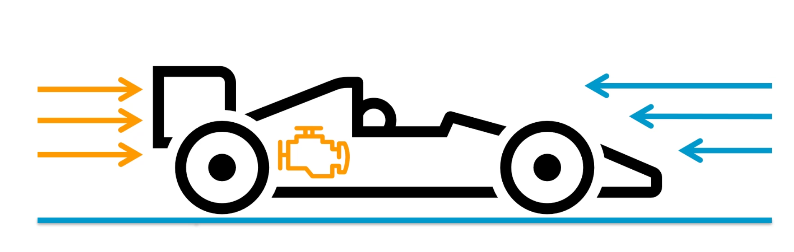
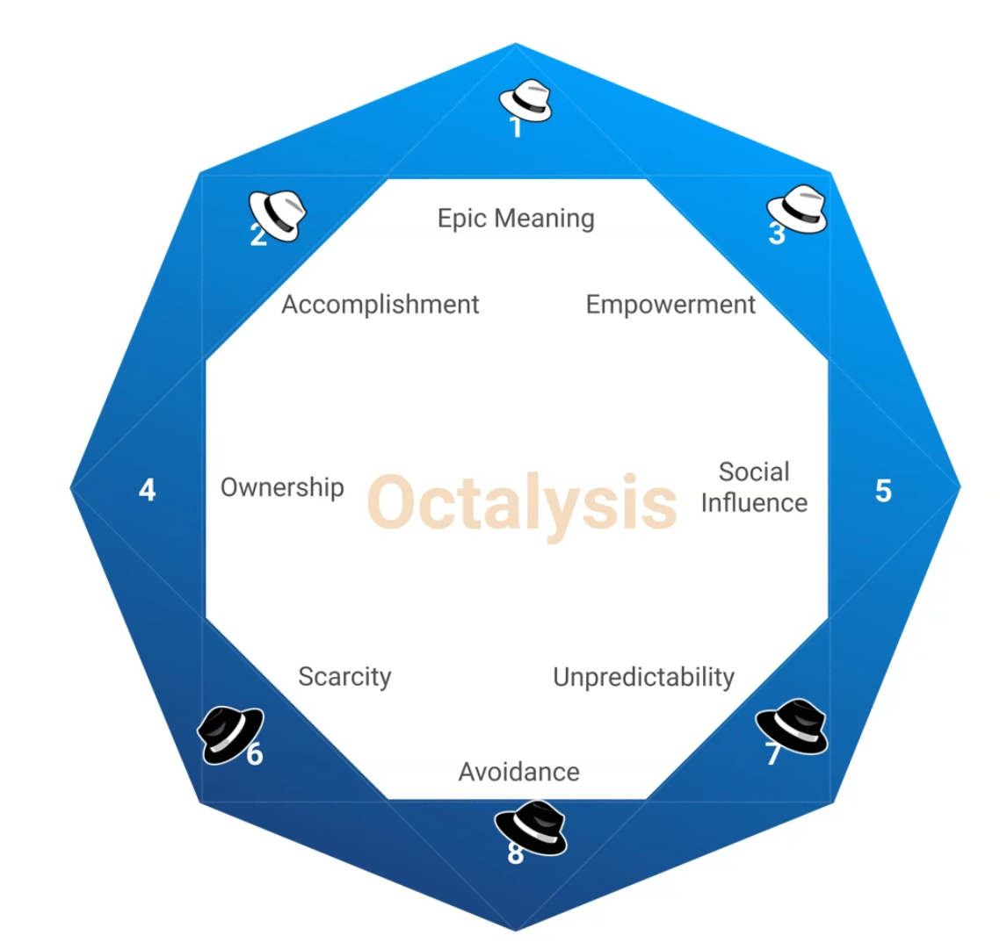
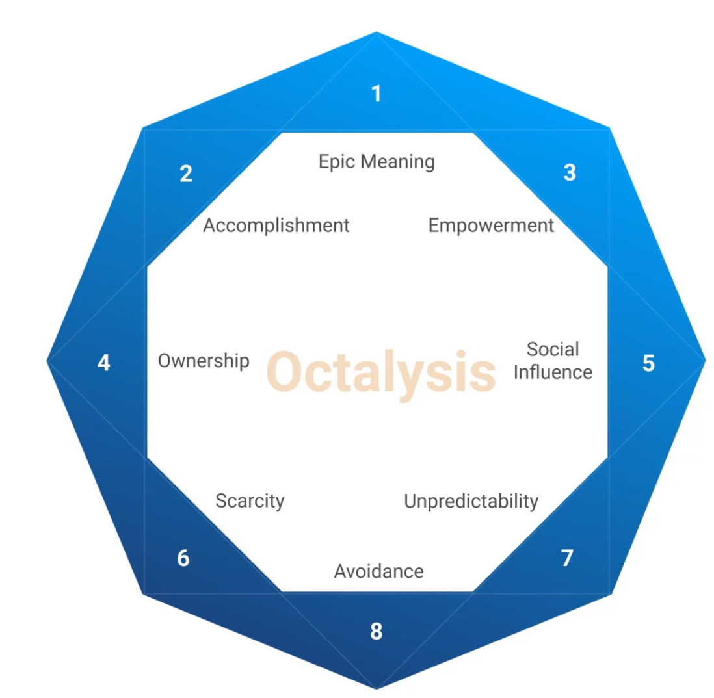

- 
- Good motivation
	- Support users to achieve something
	- Make something users need to do, more engaging.
	- Make the world a better place.
-  
	- Black hats are not good over time but still help.
	- Examples
		- https://i0.wp.com/yukaichou.com/wp-content/uploads/2012/10/Farmville-Gamification.jpg?w=600&ssl=1
		- https://i0.wp.com/yukaichou.com/wp-content/uploads/2012/10/Diablo-3-Gamification.jpg?w=600&ssl=1
		- https://i0.wp.com/yukaichou.com/wp-content/uploads/2014/03/Candy-Crush-Octalysis.png?w=600&ssl=1{:height 388, :width 506}
		-