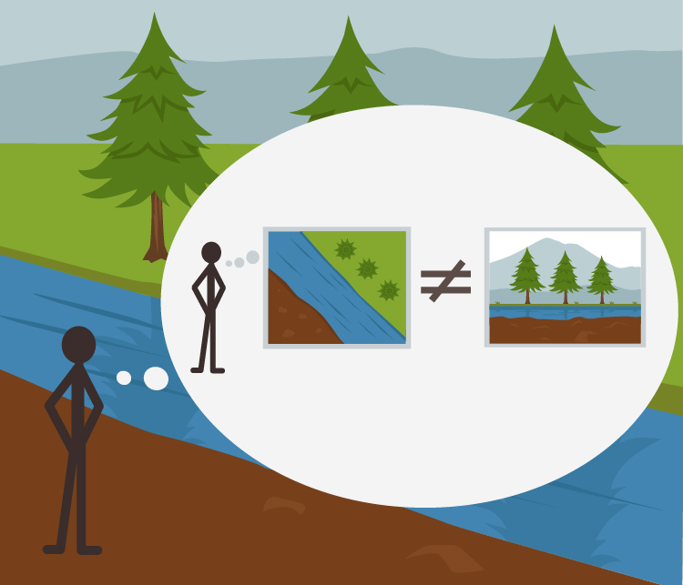

- A map *is not* the territory it represents, but, if correct, it has a *similar structure* to the territory, which accounts for its usefulness. - Alfred Korzybski, *Science and Sanity*, p. 58.
	-
-
- 
- [[Comments]]
  collapsed:: true
	- [[Sat, 2022/07/16]]
	  collapsed:: true
		- ((62d2dc08-deb8-4a8b-a002-0f867d79aad1))
			-