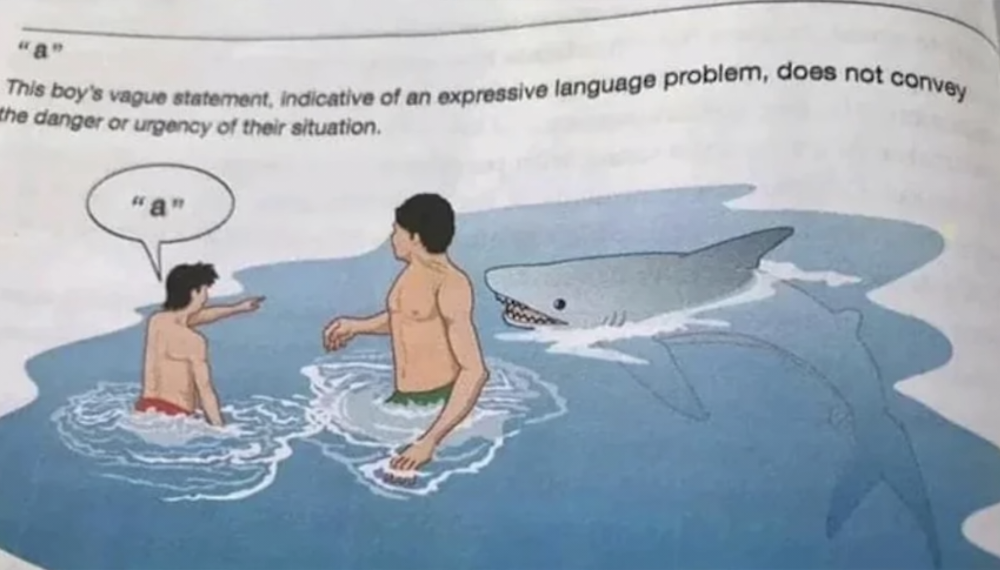

- #card  
  [[Toki Pona]] for:  
  {{cloze interjection. exclamation, ah! oh! ha!, emotion, emphasis, confirmation}}
  
  {{cloze particle. emphasis, confirmation, emotion}}
	- Sign:
		- {:width 200}
	- Pronunciation:
		- 
	- Disambiguation:
		- *a a a!* is commonly used as laughter (hahaha).
		  