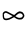

- #card  
  [[Toki Pona]] for:  
  {{cloze noun. everything, existence, life, universe, all that exists, abundance, one hundred}}
  
  {{cloze adj. all, every, complete, total, abundant, plentiful}}
  
  {{cloze verb. pervade, commodify, make universal}}
	- Etymology:
		- From Dutch *alle* (all).
	- Sign:
		- {:width 200}
	- Pronunciation:
		- 
	- Disambiguation:
		- *ale* is sometimes referred to as *ali*.