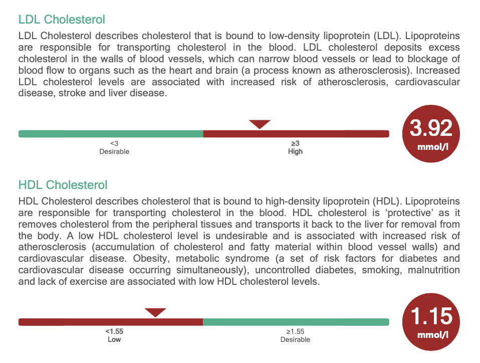

- Cholesterol = HDL level + LDL level + 20% of your triglyceride level
- 
- 
- Total = 3.92 + 1.15 + 0.2 * 0.76 =?
- 1. Reduce egg, saturated fats and trans fats.
- 2. Increase Vitamin D -> can break down into HDL
  3. More whole grain foods.
  4. Check for [**familial hypercholesterolaemia**](https://www.heartuk.org.uk/cholesterol/what-is-fh)