tags:: pilin

- A sensation is the collective of experiences.
- Experiences are **subjective** with an **inter-subjective component**.
	- Conditions such as blindness, deafness, etc. all have an effect on experience.
	- Different parts of the brain light up for different people depending on what image you show them.
	- The same human expression can be carried out at lower (unconscious) and higher (conscious) levels of the brain, like breathing or talking to people.
		- See
	- Just because he breathes, does not mean that he consciously experiences himself breathing.
	- Given a behaviour, you hence cannot guess the conscious experience with high certainty.
- Any consciousness of experience can be thought of as
- The philosophical zombie:
	- Exactly the same person, except for missing their consciousness.
- The anti zombie:
	- If someone is copied by atoms he must necessarily be conscious (anti zombie by construction).
- We are planning machines.
- We are planning machines. Po-Shen Loh finds a heuristic for reading math text books where complexity = # of insights.
- Experiences can be sorted into **categories**, a favourite past-time of philosophers.
	- **Unintentional experiences** are also called **imprinted** experiences, because they are forced onto you.
		- You can however choose to not focus on them.
		- Rudimentary external senses:
			- Sight
				- Colour
				- Silhouette
			- Smell
			- Taste
			- Auditory senses
			- Touch
		- [Object]([[objects]]) recognition
			- Face recognition
		- [[Language]] recognition through writing, sound or braille.
			- 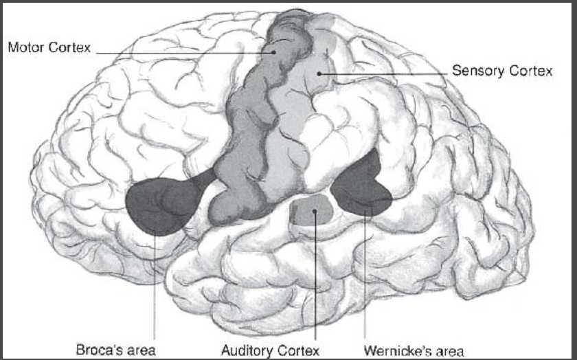{width 400}
			- Wernicke's area: Speech recognition.
				- Without it, a person speaks fluently but utters nonsense (Wernicke aphasia).
			- 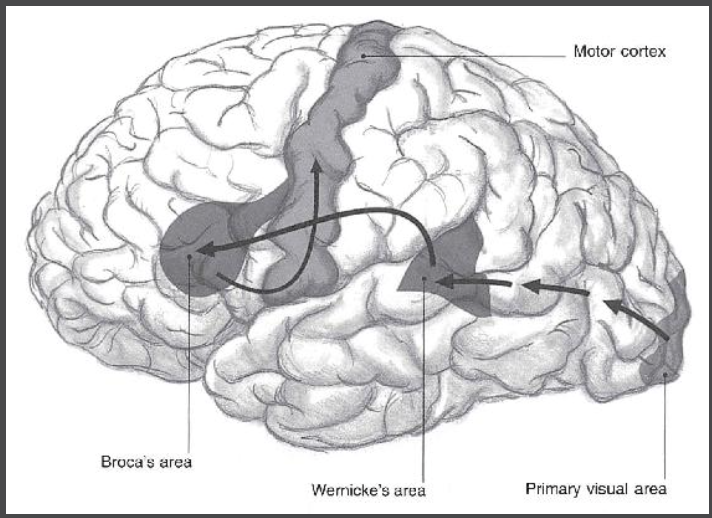{width 400}
			- Broca's area: Controls movement of speech
			- Reflex and walking is a low level brain function, planning to walk somewhere requires more intention.
			- Low brain
				- Breathing and controlling a heartbeat is unintentionally controlled by the **medulla**.
				- Sleeping and waking is done unintentionally by the **reticular formation**.
				- The **pons** links sense information to the **cerebellum** which activates motor functions such as walking. It also stores skilled movement sequences, adds fine tuning and timing to movements selected elsewhere.
				- 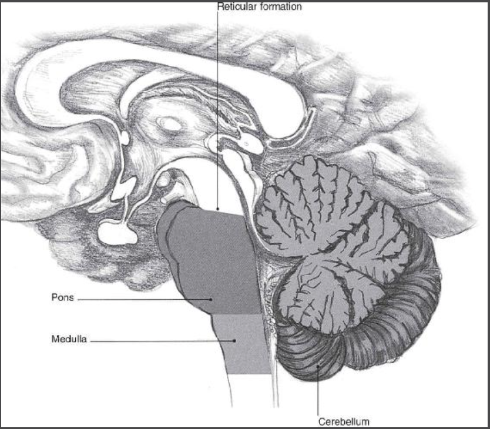{width 400}
		- Internal unintentional sensation
			- Hormones:
				- 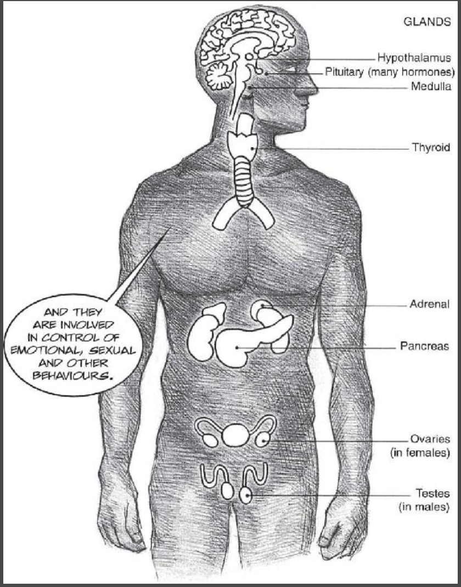{width 400}
				  Control feelings such as happiness, hunger, blood-sugar levels.
		- Automated intentional sensations / habits
			- These are intentional experiences that become unintentional, habitual.
			- Accent of speech.
			- Automatic negative thoughts (ANTs)
			- If you stop paying attention to unintentional sensations, eventually you will lose them. Use it or lose it.
	- Intentional experiences
		- Experiences that require **attention = effort of the [[will]]** are so called **intentionalities**.
		- Midbrain
			- **basis pedunculi, tegmentum** control intentional movement. Dopamine shortage here leads to Parkinson.
			- **tectum** contains auditory and visual cells that govern unintentional reactions to light and sound.
			- 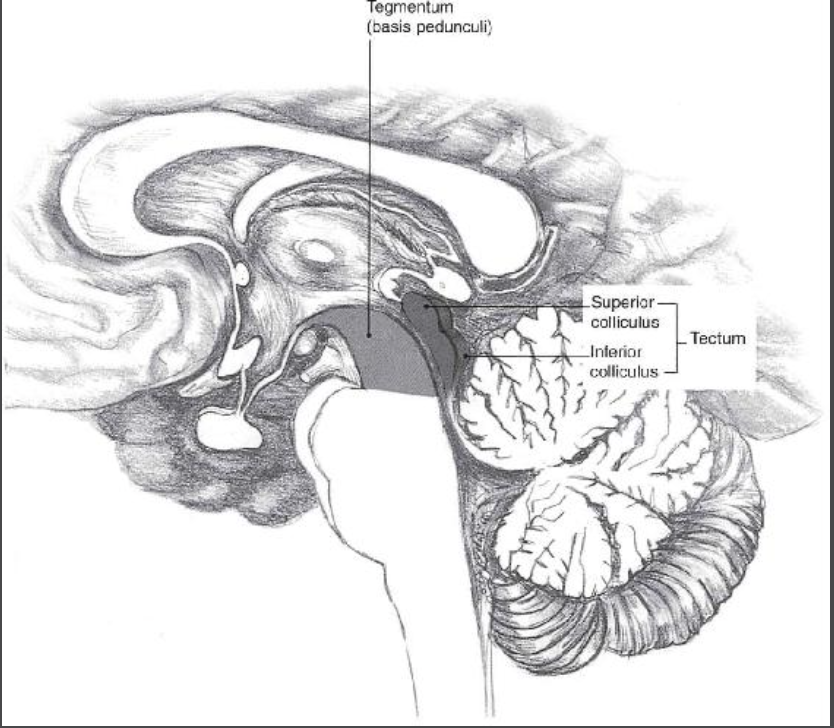{width 400}
		- Imagination, memories and beliefs
			- Locke categorises these experiences into heavy and less heavy experiences, for example memories have been directly imprinted and are thus harder whereas remixed imaginations are more light.
				- 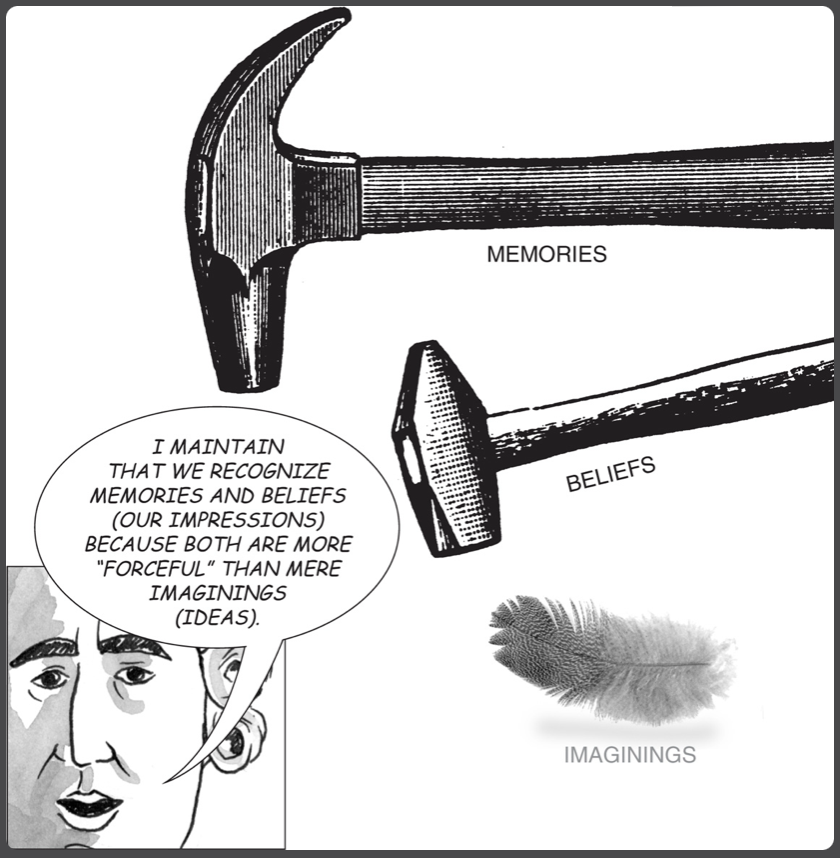{width 400}
		- Transforming thoughts into spoken [[Language]].
			- In Wernicke's model, ideas are transferred into words in **Wernicke's area** and words into sounds in **Broca's area** which lastly is turned into motor movements in the **motor cortex**, all happening in the left hemisphere.
			- {width 400}
			- However, well-practiced behaviours / habits pass to sub-cortical centres and will happen **without attention** outside of the cortex.
				- 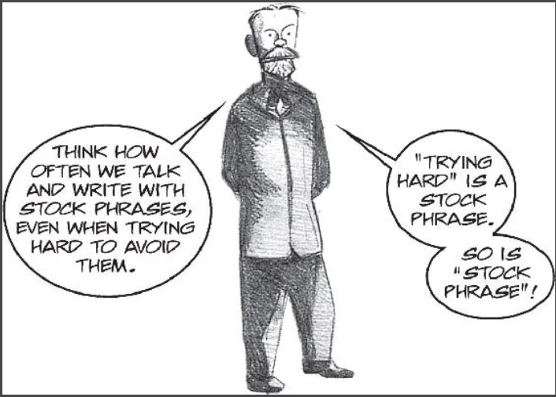{width 400}
			- Further, damage to the right hemisphere will still affect language, for example it may cause hesitations and repetitions in speech, emotionless monotonic voice or understanding of indirect questions.
			- Further there are people with just one
			- Sicknesses:
				- Broca's aphasiac
					- Symptoms: Utter sentences incoherently and especially have troubles with verbs.
					- Damage: Broca's area and neo-cortex area with the motor cortex.
					- Conclusion: Close to motor actions, language actions are stored in broca's area.
					- 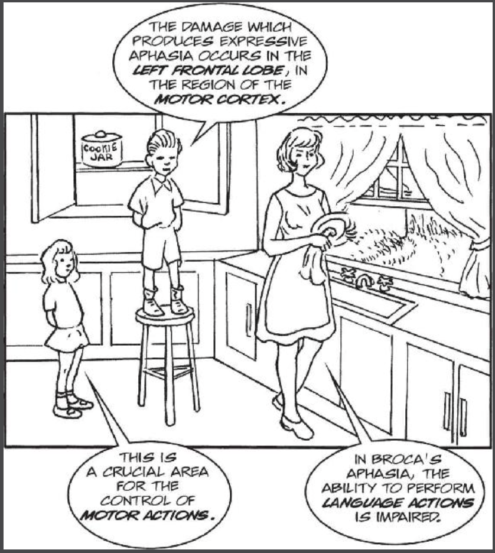{width 400}
				- Wernicke's aphasiac
					- Symptoms: Speaks fluently with well-formed sentences but the sentences themselves lack meaning. In addition, language comprehension is impaired. The same happens with sign language.
						- 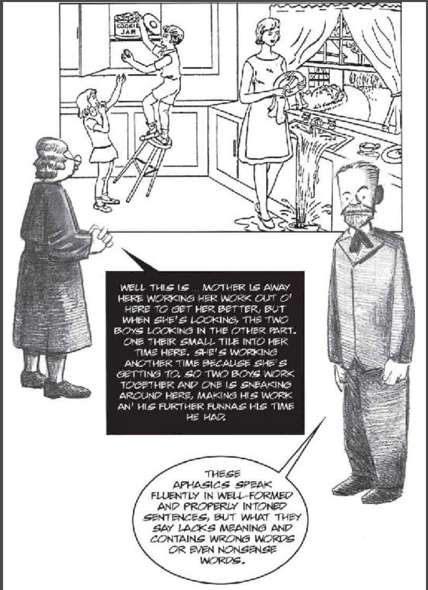{width 400}
					- Damage: Wernicke's area, close to the sensory cortex.
				- Anomic aphasiac
					- Symptoms: Can state well-formed sentences but struggles to find the correct names/nouns and uses indefinite words like 'thing'.
						- 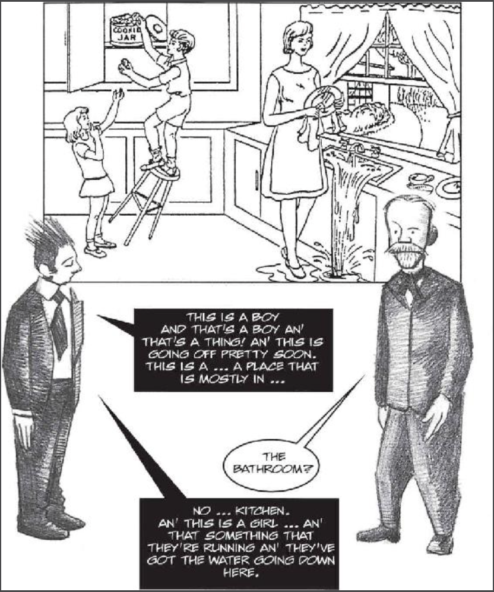{width 400}
					- Damage: Temporal lobe, which plays a major part in object recognition. Color anomic aphasiacs tend to have damage close to the occipital lobes that specialise in perception of colours.
						- 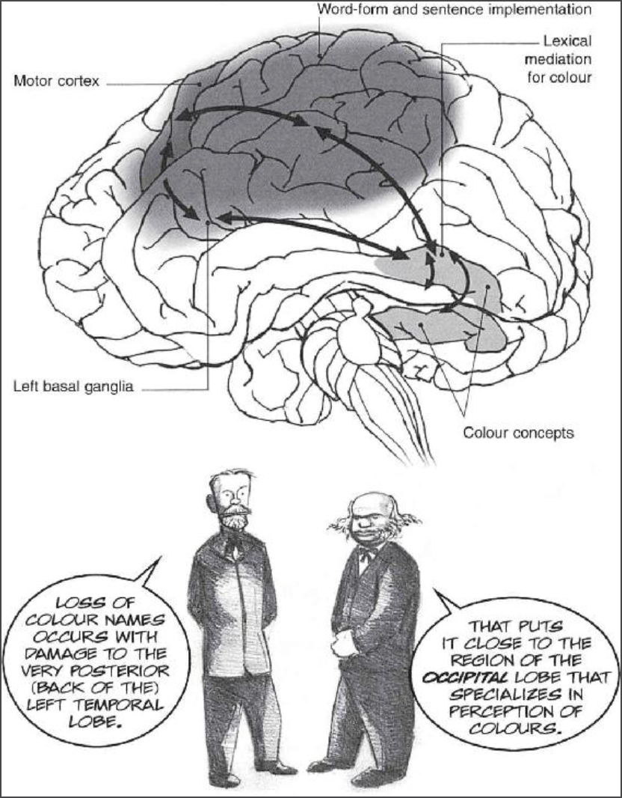{width 400}
			-
- Note that experiences are derived from the shared reality. The experiences are not the territory but are merely created from it. Just like trace properties are derivatives of a running computer program. Just like a traffic light turns red as a consequence of the microcontroller of the traffic light system.
- Consciousness is independent of awareness.
	- Awareness is necessary, consciousness is not.
	- You are constrained.
	- We would not talk about freedom of will if we were truly free.
	- Why do we talk about consciousness if we are not conscious?
	- Philosophical zombies are not unlikely
- Pragmatism and the concept of identity can quickly spread as concepts in culture. If you don't believe in agency, it means that effectively that your culture shapes you.
-
- I will now entice your mind with a strategy in the hopes it catches on which will have a ripple effect on your experience. vs. Do this and you'll be happy.
-
- Pragmatism and the concept of identity can quickly spread as concepts in culture. If you don't believe in agency, it means that effectively that your culture shapes you.
- Final choice is implemented by an argmax function or a reservation price mechanism.
-
- Interaction with the content of experience, the experience presented to it, is called attention or intention.
	- No free will is still possible, you just experience the intention.
- Experiences that require **attention = effort of the will** are so called **intentionalities**.
- The will of programming
- Forcefulness / vividness of impressions:
- {width 400}
- Experiences consist out of intentional and unintentional sensations.
	- **Unintentional** experiences
		- **Imprinted** experiences (seeing, hearing, touching, smelling, tasting)
			- Low leve
			- [Object]([[objects]]) recognition
				- Face recognition
			- [[Language]] recognition through writing, sound or braille.
				- {width 400}
				- Wernicke's area: Speech recognition.
					- Without it, a person speaks fluently but utters nonsense (Wernicke aphasia).
				- {width 400}
				- Broca's area: Controls movement of speech
				- Plasticity!
				- Reflex and walking is a low level brain function, planning to walk somewhere requires more intention.
				- Low brain
					- Breathing and controlling a heartbeat is unintentionally controlled by the **medulla**.
					- Sleeping and waking is done unintentionally by the **reticular formation**.
					- The **pons** links sense information to the **cerebellum** which activates motor functions such as walking. It also stores skilled movement sequences, adds fine tuning and timing to movements selected elsewhere.
					- {width 400}
				- Midbrain
					- **basis pedunculi, tegmentum** control intentional movement. Dopamine shortage here leads to Parkinson.
					- **tectum** contains auditory and visual cells that govern unintentional reactions to light and sound.
					- {width 400}
		- Internal sensation
			- Hormones:
				- {width 400}
				  Control feelings such as happiness, hunger, blood-sugar levels.
		- Automated intentional sensations:
			- Saying something out of habit.
			- Automatic negative thoughts (ANTs)
			- If you stop paying attention to unintentional sensations, eventually you will lose them. Use it or lose it.
	- Attentive sensations
		- Intentionally controlling an unintentional sensation
		  collapsed:: true
			- Breathing is a good example. When intentionally breathing, different parts of the brain are used.
		- Oftentimes intentional experiences become automatic unintentional experiences, such as speaking certain words, etc. This is why when we speak not only the motoric bla lights up but also the rest of the brain.
		- Use it or lose it. If you don't lose them
		- Wernicke's aphasiac
		-
	- Motor nerves
		- It is not clear whether
	- Memories
	- Beliefs
	- Idea generation -> Motor function(?) Trainable skill
	- Inner voice
	- Motor functions
- Experiences are **imprinted** on the individual and thus not chosen.
	- Experiences come from direct and indirect stimulus.
	- Stimulus is then carried out through habitual decisions.
	- If sufficiently trained in mindfulness, a stimulus before the habitual decision can be used to redirect it.
	- Inner voice to keep you on a task.
	- Even if there is no such thing as a free decision, as long as humans keep working on intentional language that make them attentiv it is good.
	- Beliefs
	- Forcefulness / vividness of impressions:
	- {width 400}
	-
	- Everything is instinct.
		- Instinct
		- Attention
		- I will do X is
	- Ego is not the sequence of experience. It is merely a causal object identified in the sequence of experience.
	- Ego is a very useful identification, brought about in part through social interactions through commitments, identity, language through names and pronouns, etc.
		- But can make you guided by narratives. Narratives control you.
	- For example, through language your parents and friends might call you a girl but you happen to have a large INAH3 which makes you sexually more feel like a boy.
	- and sequence of experience will tell you your gender, but a part of your brain, the
	- For example, an area of the hypothalamus, part of the brain well known to be concerned with sexuality (but also with eating, drinking, [aggression](https://www.psychologytoday.com/gb/basics/anger) and other means of survival) is larger in males than females, and smaller in male-to-female transgender brains.
	-
	- Note non of these things require consciousness.
	- Instinct of self-preservation of mind.
	-
	- Luckily we have an attention mechanism with which we can decide whether or not to indulge in something.
	- Mindfulness is one of those habits that can be effectively trained that forces you to decide for each experience whether or not to pay it mind. Note that no free will is necessary to explain attention or mindfulness. It is simply past down by people and algorithms.
	-
	- Use it or lose it. It is a privilege to have sight or hearing.
	-
	- Given a stimulus you can decide to focus your attention on it. Meditation teaches you how to let go of things that grab your attention and helps you intentionally focus on what you ought/want to focus.
		- Think of a pink elephant.
		- Stranger asking you: Tell me how to get to the closest McDonalds.
		- Your body telling you, you have to pee, poo.
		- A compulsion telling you to drink alcohol or smoke nicotine.
		- We have an ability to choose to focus on a prompt. First we read the prompt, then we decide if we want to follow through with it.
		- The problem with information overload is that you get very defensive to which prompts you want to follow.
	-
	-
	- Use it or lose it. Replace it and lose it, to gain something new.
	- Memory can be lost, so can visualizing and so on. These can also be deliberatively lost and replaced.
	-
	- 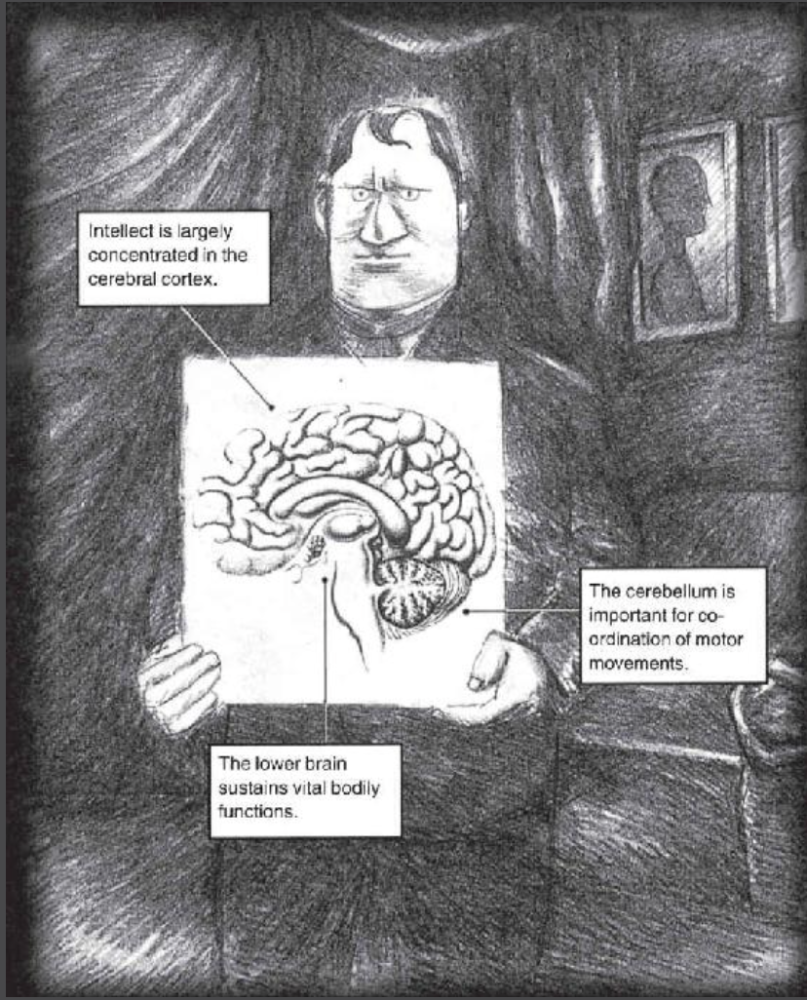{width 400}
	  Marie-Jean-Pierre Flourens (1794–1867)
	- 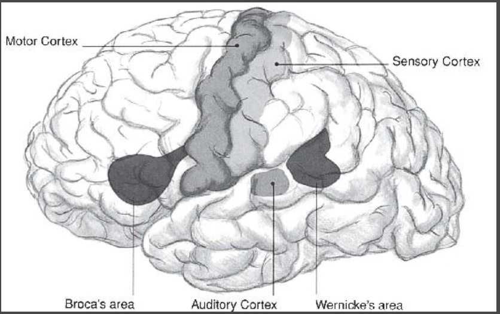{width 400}
	- Senses.
		- Outside sensation (seeing, hearing, touching, smelling, tasting)
			- [Object]([[objects]]) recognition
				- Face recognition
			- Outside [[language]] recognition through writing, sound or braille are also part of these experiences.
		- Internal sensation
			- Hormons are responsible for them:
			- {width 400}
			- Hunger, happiness, blood-sugar levels, hormones
	-
	- Expressions
		- Movements
			- Motor cortex: Muscle movement
			- Broca's area: Movement of speech
			- Auditory cortex:
			-
	- Idea generation machine
	- Problem solver: Can take a word
	- Beliefs
	- Attention-mechanism system to control which experiences we focus on.
	- Sense experience (seeing, smelling, hearing, tasting, touching).
	- Idea generation machine usually paired with a scrutinizer
	- Map (possible in territory X)
	-
	- Memories
		- I don't have to remember my bank account as a modern human thankfully.
	- Beliefs / Scrutiny / Language formalism -> Would it be amazing enough to share.
	- Ideas pop up that I then scrutinize with for example information surprisal and utility (i have a truth scrutinizer but its mostly automatic -> truth vs. possibility).
	- Possibility scrutinizer, is it possible that i can do X.
	- Ideas  -> new words are brought up which are then scrutinised.
		- Engare++,
	- Will: Achieving X.
	- Language that achieves putting us in the right location.
	- Attention mechanism moves ideas to scrutiny apparatus.
- Imprinted experience > Memories > Beliefs > Imaginings (Ideas)
-
