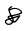

- #card  
  [[Toki Pona]] for:  
  {{cloze noun. dirt, filth, garbage, pollution, infection, disease}}
  
  {{cloze adj. gross, disgusting, repulsive, dirty, filthy, unclean, unsanitary, toxic, infectious, sickly}}
  
  {{cloze verb. pollute, dirty}}
  
  {{cloze interjection. ew, yuck}}
	- Etymology:
		- From English *yucky*.
	- Sign:
		- {:width 200, :height 236}
	- Pronunciation:
		- 