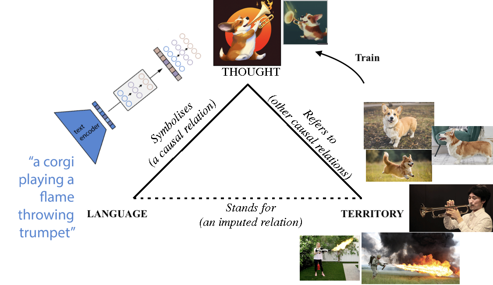
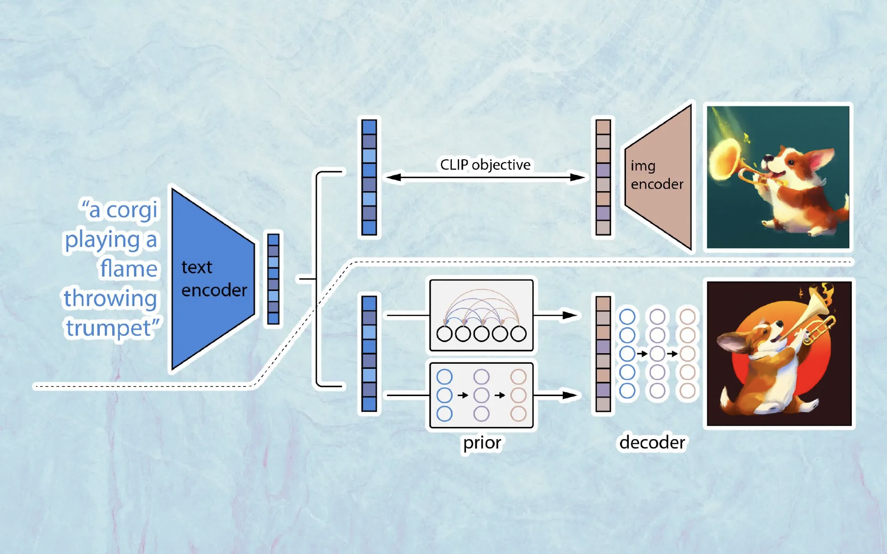
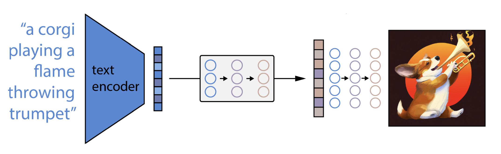

tags:: nimi

- One cannot proceed from the informal to the formal by formal means. — Epigrams in programming by Alan J. Perlis #quote
- Since logic is a language, that language has to be learned. Like many languages in many circumstances, the language has to be learned by suggestions and clues. Frege repeatedly states, when introducing his system, that he is giving ’hints’ to the reader, that the reader has to meet him halfway and should not begrudge him a share of ’good will’. The problem is to bring the reader to ’catch on’; he has to get into the language. — excerpt from a book on Frege #quote
- Probably the most useful [[transhumanistic tool]].
- Not to be confused with proper names like Kevin and Miya.
- 'Name' exists, means that the thought of the name is in the territory.
- Proving absence of stuff is harder!
- Language is a direct feedback mechanism of experience. We develop inner speech as a sensation. Learning a language can only be learnt through suggestion and
-
- driven by our lymphatic system
- Language shapes our thinking and so does our mind and brain.
	- Extreme case for language shaping our function is that of computers and their formal programming languages. The computer only does precisely what the formal programming language states.
- https://upload.wikimedia.org/wikipedia/commons/3/30/Wernickeges2.gif
- PL vs. DPL
- https://cb125.github.io
- History #learning
	- Discuss different approaches to the problem.
	- Observations vs. inferential knowledge.
	-
- https://github.com/cb125/Dynamics/blob/main/Papers/groenendijk-stokhof-dpl.pdf
- Outer world
	- Stuff
	- Sortals
- Inner world
	- Map of truth
	- inner monologue of thoughts
	- input: sensory information, language, monologues -> thought state machine -> actuators, language, attention of inner monologue
	-
	-
- In addition to our map and the territory, we use language to communicate our thoughts and beliefs.
- 
- We name common shared experiences
	- We learn/**determine** that swans are swans by others **referring** to them as swans. These are *prototypical members* of swans.
	  collapsed:: true
		- {:width 500}
	- 
	- 
	-
	- such as [[territory]]. [[Toki Pona]] is deflationary and recognises that most shared experiences are constituents of other shared experiences.
	- We might be inclined to call every large white feathered biped with a long neck a swan by definition, but this is not how we categorise things. When you see a bird that looks identical to a swan except for its color you would understand the term 'black swan'.
	  collapsed:: true
		- 
	- We learn that swans are swans by others referring to them as swans:
- Naming can be difficult. Is it a muffins or a chihuahua?
	- 