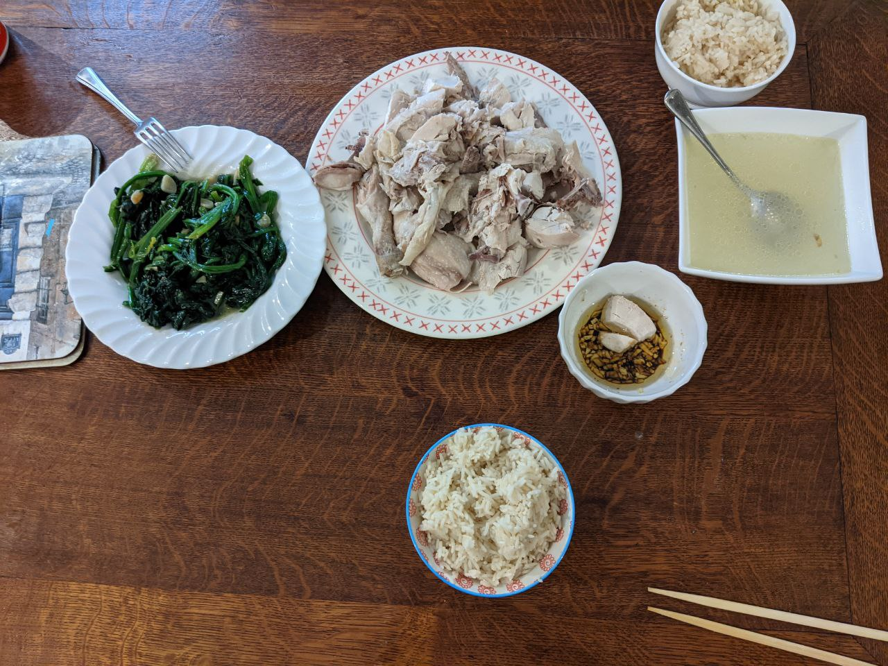

tags:: moku

-
- Moku pi jan miya en jan kewin li olin.
-
- Juice
	- Mild orange juice diluted with water.
	- Celery juice
	- Carrot juice.
- Joghurt
	- Vermicelles joghurt
	- Stichfest kafe joghurt
	- Pana cota
- [[Tortellini with spinach]]
- [[Spaghetti Napolitana]]
- [[Avocado toast]]
- [[Turkey slice with frozen veggies ala Mia]]
- [[Hainenese hotpot]]
- [[Celery with chicken]]
- [[Shrimp with garlic and soy sauce]]
- [[Poke bowl]]
- [[Greek salad]]
- [[Paps salad]]
- [[Burger]]
- Fish
	- [[Seared fish]]
	- [[Fish with lemon]]
- Spicy food
	- [[Sundubu]]
	-
- [[Melon with prosciutto crudo]]
- [[Cooked vegetables]]
- [[Baked beans with sausage]]
- [[Baked beans in british pudding]]
- [[Shio ramen]]
- Buns
-
-
- Chicken with [[Hainan sauce]].
	- 