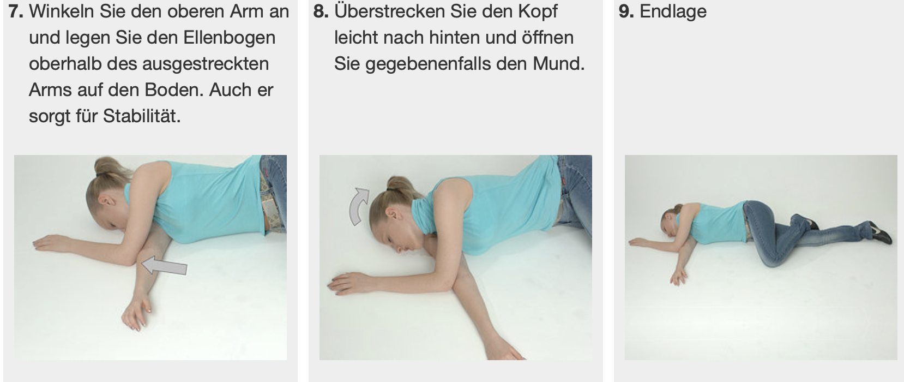

- Judge the situation
	- look
		- who is under a life threatening situation?
		- how many patients are there?
		- how many people are there to help with what qualifications?
	- think
		- how should the safety workload be split?
		- how will i act?
	- act
		- Bring the person to safety (away from road eg.)
		- Talk to the person to see if s/he is alright?
		- Hygienic, wear gloves use disinfectant.
- Car accidents
	- What to do
		- Bring car to safety line.
		- Wear orange vest.
		- Put triangle outside.
		- Emergency lights.
		- Protokollierung des schadens (Foto)
		-
	- Help someone
		- Bring the person to safety.
		- Talk to the person to see if s/he is alright?
		- Open the door carefully.
		- Talk to the person again.
		- Open the seat belt.
		- Wear hygienic gloves.
		- Turn so you can grab the person at their underarms.
		- {:height 372, :width 537}
		- Ansprechbare Personen sollen grundsätzlich so behandelt werden wie sie es sagen.
		- 
		- 
-
- Further treatment
	- If conscious, ask him for pain points.
		- Find them
		- People with back pain or don't feel their arms and legs should not be moved.
		- Get more people to help.
		- Ask if you can warm the person.
			- 
			-
	- Bewusstseinslos / Unconscious
		- Check by asking loudly.
			- If he moves his muscles he is not unconscious, even just opening the eyes.
		- Next check his breathing.
		- Causes
			- Head damage.
			- Sauerstoffmangel.
			- Poison.
			-
		- Problems
			- Tongue muscle may loosen and block breathing ways.
			- Stomach muscles may leak liquid.
			- Gums might fall into the mouth, block air.
	- Place person in this position
		- Breathing but unconscious:
			- 
			- 
			- 
			- Die überstreckte Kopfhaltung ist am wichtigsten!
		-
- BLS (Basic Life Support)
	- Herzinfarkt
		- Auslösung
			- Medikamente, Alkohol
		- Geben von Nitroglyzerin falls verschrieben/vorhanden.
	- Hirnschlag
		- Sauerstoff- und Nährstoffversorgung
		- {:height 561, :width 506}
		-
	- 
	- Hole Hilfe um 144 anzurufen, Defibrillator zu holen und ein weiterer Helfer zum beatmen.
	- 
	- 2x pro Sekunde, 100-120x pro Minute, 5-6 cm tief drücken.
	- Nach 30 mal drücken, eine Sekunde mit **zwei** Beatmungsstössen helfen.
- Call for help
	- Swiss emergency numbers
		- 117 - Polizei
		- 118 - Feuerwehr
		- 144 - Sanitätswagen
		- 1414 - Rega (Helikopter)
		- 145 - Tox Info Suisse (Giftunfall, Drogen)
		- 112 - Allgemeine Notnummer
	- Wo
	- Wer ruft an?
	- Was ist passiert?
	- Wie viele Personen sind betroffen?
	- Welche Art der Verletzung?
	- Weiteres: Auslaufendes Benzin, etc.
- Verbrennung
	- Löschen mit Wasser und Kleider.
	- Entfernen der Kleider sofern sie nicht kleben wegen Aufschwellungen.
	- Kühlen 15-2o Minuten mit lauwarmen Wasser.
	-