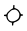

- #card
  card-last-score:: 5
  card-repeats:: 2
  card-next-schedule:: 2022-07-13T06:37:00.120Z
  card-last-interval:: 4
  card-ease-factor:: 2.6
  card-last-reviewed:: 2022-07-09T06:37:00.123Z
  [[Toki Pona]] for:
  {{cloze noun. sun, light, glow, radiance, brightness, shine, light source}}
	- Etymology:
		- From Esperanto *suno*, from English *sun*.
	- Sign:
		- {:width 200}
	- Pronunciation:
		- 
-