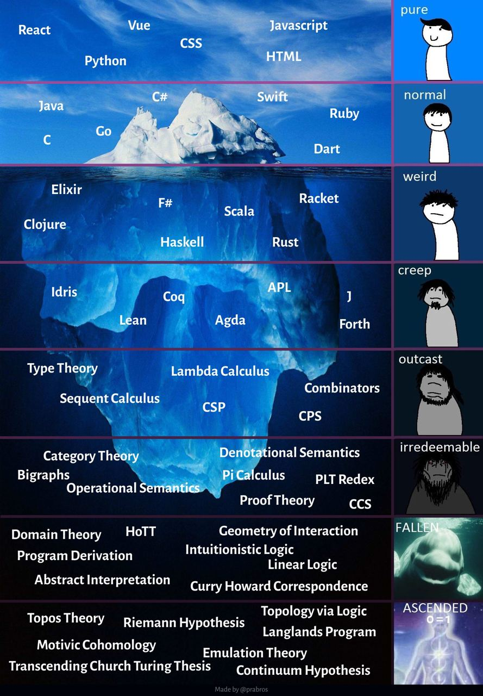

tags:: sona

- Tags are navigational themes with two use-cases [[types]]:
- Thematical tags
	- All pages in this site are thematically tagged by a [[Toki Pona]] word.
- Index tags
	- These tags are supposed to group parts of pages, for example #quote
- Sequences
  :LOGBOOK:
  CLOCK: [2022-07-31 Sun 15:43:27]
  :END:
	- These tags show that a page is part of a  ((62f2742f-8afe-4b59-adfe-2cb36352d603)).
-
- TODO Iceberg diagrams
  collapsed:: true
	- 
- Source: https://forum.obsidian.md/t/obsidian-zettelkasten/1999/126?page=7