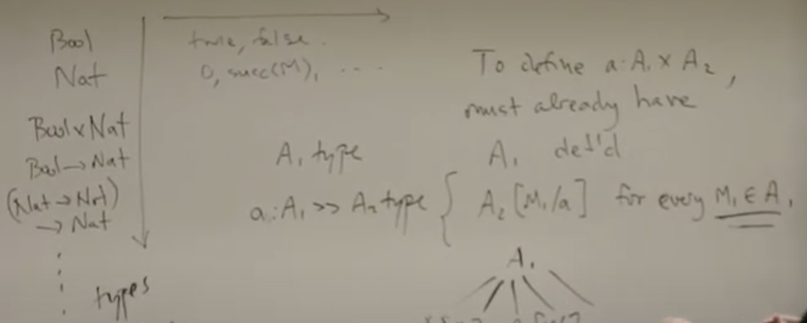
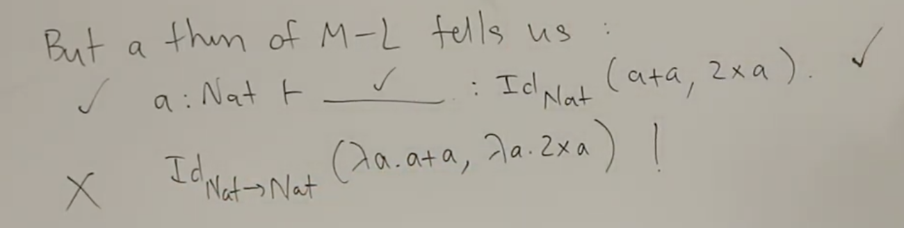
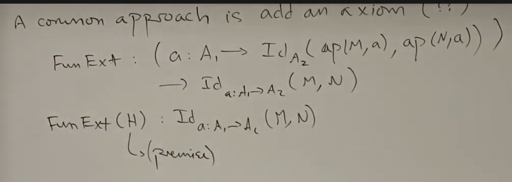

- "Types are behavioural specifications." - R. Harper
- Inductive types (W-type)
- Coinductive types (M-type)
- Non-dependent Products and functions
- Dependent products (𝚺-type) and dependent functions (𝚷-type)
- [[Haskell]] only has vertical induction (and typeclasses).
	- Dependent types have vertical induction!
		- https://www.youtube.com/watch?v=GzPMZ6RsihU
	- 
- "Propositions as types" aka. Semantic correspondence aka. Realizibility -> from Brouwer
	- type is primary and is more extensive than mere logic.
	- choice function as the axiom of choice
	- R is total:
		- $(\forall a \in A . \exists b \in B . R(a,b)) \Rightarrow (\exists f \in A \rightarrow B . \forall a \in A . R(a, f(a)))$
	- R is total is a fact in type theory:
		- $F : (a : A \rightarrow (b : R \times R(a,b)) \rightarrow (f : A \rightarrow B \times (a : A \rightarrow R(a, f(a))))$
		- $f \overset{\Delta}{=} \lambda a . (F(a) \cdot 1)$
	- Equality type
		- Uniqueness of equality type
			- If $M \in Eq_A(M_1,M_2)$ then $M \: \dot{=} \: \star \in Eq_A(M_1,M_2)$
				- ie. $\star \in Eq_{Eq_A(M_1,M_2)}(M, \star)$
	- All types are inherently computably enumerable
- Formal type theory is defined by a bunch of rules for deriving
	- 'definitional equality' => could call it formal equality
	- $\Gamma \vdash A \text{ type}$, $\Gamma \vdash A \equiv A' \text{ type}$
	- $\Gamma \vdash M : A $, $\Gamma \vdash M \equiv M' : A$
- Extensional
	- forall x . f x == g x => f == g
	- $M \dot{=} M' \in \text{Nat} \rightarrow \text{Nat}$ informally means that $\forall M_1 \dot{=} M_1' .\: \exists P_1 \dot{=} P_1' .\: ap(M, M_1) \Downarrow P_1  \dot{=} ap(M', M_1') \Downarrow P_1' \in \text{Nat}$
	- Extensional equality gets relentlessly more complicated.
	- What about functions who have existential and forall types? Second-order functions, etc.
	- Products are dependent
- Decidability problem
- Formalism is just a means of deriving truths (about computations).
- Type erasure => remove info
	- soundness wrt. erasure
	- logical relation
-
- All judgements should be decideable! -> Empiricists nightmare, rationalist dream.
-
-
- Canonicity problem
	- If $M : \text{Bool}$, then $M \equiv \text{true} : \text{Bool}$ or $M \equiv \text{false} : \text{Bool}$
	- If a type exists it can be evaluated...
- ETT = equality reflection uniqueness
	- expressive, undecidable
- ITT
	- formalizes $Id_A$ as the least reflexive operation.
- Notion of 'least x that fulfils' is very very powerful. *And nothing more*.
	- If it quacks like a duck, floats like a duck, etc. but also backflips like a breakdancer it is NOT a duck!
- How to implement your own type system
	- https://www.andres-loeh.de/LambdaPi/LambdaPi.pdf
	-
- Failure of function extensionality: Martin Löf tells us that:
	- 
	- Strange solution, add axioms to type theory:
		- Strength in weakness (Hofmann, Streicher)
			- ITT cannot prove internally, that there is only one identification!
			- groupoid model is an equivalence relation with evidence.
		- 
			- Valid under erasure
				- $|FunExt(H)| = \star$
			- Ruins canonicity.
			- J(a,b,c.C)(a.Q)(FunExt(H)) ??
			- Solved with OTT using cubical methods!
			- Has a computational interpretation!
	- https://arxiv.org/abs/2103.02177
	- FOL is not enough for infinite graphs or natural numbers!!
- Univalence
	- Useful to "identify structures up to isomorphism".
	- Examples in type theory:
		- $A \times B \equiv B \times A$
		- by swap is a bijection
	- Axiom
		- $UA ("swap") : Id_U(A \times B,B \times A)$
		- universe: type of types
		- J(a,b,c.C)(a.Q)(UA(E)) is not canonical
		- CCHM18 (coquand), AFH17-18 (harper et al)
		- cartesian cubical methods
-
-
-
-
-
-